

  

<h1 align="center">Hamas Rafique</h1>

  <strong>Software Quality Assurance Engineer | WordPress Developer | Computer Science Student</strong>

  
  
  

  

---

## Professional Introduction

I am a BSCS student from Karachi, Pakistan, focused on Software Quality Assurance, test automation, API testing, and WordPress development. I combine a tester's attention to detail with a developer's understanding of how systems are built, maintained, and improved.

My goal is to help teams ship reliable, user-friendly software through clear test cases, practical bug reports, thoughtful regression coverage, and continuous learning.

## About Me

- BSCS student building a career in Software Quality Assurance.
- Focused on manual testing, smoke testing, regression testing, exploratory testing, and API testing.
- Learning advanced Selenium automation with C# and MSTest.
- Experienced with WordPress websites using Elementor, WooCommerce, and custom CSS.
- Comfortable working with Node.js, Express.js, MongoDB, Git, GitHub, VS Code, Postman, Jira, and Vercel.

## Experience & Current Focus

| Area | Current Focus |
| --- | --- |
| Software Testing | Test case design, bug reporting, STLC, SDLC, regression coverage, exploratory testing |
| API Testing | Postman collections, request validation, status codes, payload checks, negative testing |
| Automation | Selenium WebDriver with C#, MSTest, reusable test flows, stable locators |
| Performance Basics | JMeter fundamentals and practical load testing concepts |
| Web Development | WordPress, Elementor, WooCommerce, custom CSS, responsive layouts |
| Backend Learning | Node.js, Express.js, MongoDB, REST API structure |

## Software Testing Stack

  
  
  
  
  
  
  
  
  
  
  

## Web Development Stack

  
  
  
  
  
  
  
  

## Backend Stack

  
  
  
  
  
  
  
  

## Featured Projects

<table>
  <tr>
    <td width="50%">
      <h3>Connect Community</h3>
      
University event management system with role-based access control, event approval workflow, budget management, notifications, and analytics dashboard.

      
  

    </td>
    <td width="50%">
      <h3>Face Detection System</h3>
      
Python and OpenCV based computer vision project for face detection using image processing fundamentals and practical detection workflows.

      
 

    </td>
  </tr>
  <tr>
    <td width="50%">
      <h3>Portfolio Website</h3>
      
Responsive personal portfolio website focused on clean presentation, project visibility, contact access, and modern frontend layout.

      
  

    </td>
    <td width="50%">
      <h3>SQA Portfolio</h3>
      
Quality assurance portfolio covering test cases, bug reports, API testing practice, test scenarios, and structured QA documentation.

      
  

    </td>
  </tr>
</table>

## GitHub Statistics

  
  

## Top Languages

  

## Activity Graph

  

## Quote of the Day

  

## Fun Facts

- I like finding small defects that can become big user experience problems.
- I enjoy writing bug reports that are clear enough for developers to reproduce quickly.
- I think strong QA is not only about finding bugs; it is about improving product confidence.
- I am building skills across testing, automation, APIs, and practical web development.

## 2026 Goals

- Build a strong SQA portfolio with real test cases, bug reports, and API testing examples.
- Improve Selenium automation skills with C#, MSTest, and maintainable test structure.
- Learn Playwright fundamentals for modern end-to-end testing.
- Practice CI/CD basics for automated quality gates.
- Contribute consistently to GitHub with polished, recruiter-friendly projects.

## Contribution Snake Animation

  <picture>
    <source media="(prefers-color-scheme: dark)" srcset="https://raw.githubusercontent.com/hamasrafique/hamasrafique/output/github-contribution-grid-snake-dark.svg" />
    <source media="(prefers-color-scheme: light)" srcset="https://raw.githubusercontent.com/hamasrafique/hamasrafique/output/github-contribution-grid-snake.svg" />
    
  </picture>

## Connect With Me

  
  

---

  <strong>Software Quality Assurance | API Testing | Selenium Automation | WordPress Development</strong>

  Designed with a dark blue theme for recruiters, collaborators, and quality-focused engineering teams.

